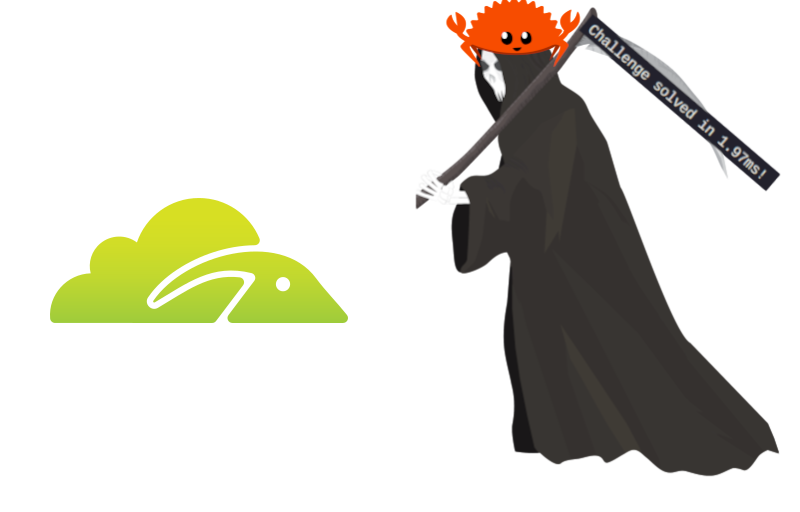

# Kiwifarms Captcha Buster



This is a command-line tool designed to solve a specific type of Proof-of-Work (PoW) challenge, often used as a captcha mechanism, encountered on sites like Kiwifarms. It automates the process of fetching the challenge, solving it, and obtaining the necessary clearance cookies.

## Features

-   Fetches initial page to extract PoW challenge parameters (salt, difficulty).
-   Solves the SHA-256 based PoW using multiple CPU cores for efficiency (via Rayon).
-   Submits the PoW solution to the `/answer` endpoint.
-   Optionally submits the temporary token to the `/check` endpoint for a final clearance token.
-   Outputs the final clearance token.
-   Optionally outputs the final HTML of the target page after obtaining clearance.
-   Configurable logging using the `log` crate and `env_logger`.
-   Timing information for network requests and PoW solving.

## Prerequisites

-   Rust programming language and Cargo (Rust's package manager). Installation instructions can be found at [rust-lang.org](https://www.rust-lang.org/tools/install).

## Building

To get a local copy of this project, clone it from GitHub:

```bash
git clone https://github.com/pixelmelt/kiwifarms-captchabuster.git
cd kiwifarms-captchabuster
```

Build the project using Cargo:

```bash
cargo build
```

For a release build (optimized):

```bash
cargo build --release
```

The executable will be located at `target/debug/kiwifarms-captchabuster` or `target/release/kiwifarms-captchabuster`.

## Usage

Run the compiled executable with the target URL:

```bash
./target/debug/kiwifarms-captchabuster --url <TARGET_URL>
```

Or, using `cargo run` (which compiles and runs):

```bash
cargo run -- --url <TARGET_URL>
```

### Options

-   `--url <URL>`: (Required) The target URL that presents the SSSG challenge.
-   `--html`: If present, the tool will fetch and print the HTML content of the target URL after successfully obtaining the clearance cookie.
-   `--check`: If present, the tool will perform an additional call to the `/.sssg/api/check` endpoint with the token obtained from `/.sssg/api/answer`. By default, this is skipped, and the cookie from the `/answer` response is assumed to be sufficient.

### Logging

The application uses `env_logger`. You can control the log level using the `RUST_LOG` environment variable.

-   Default (no `RUST_LOG` set): Usually shows warnings and errors.
-   Info level (shows general progress, timing):
    ```bash
    RUST_LOG=info cargo run -- --url <TARGET_URL>
    ```
-   Debug level (shows more detailed information, including API request/response details):
    ```bash
    RUST_LOG=debug cargo run -- --url <TARGET_URL>
    ```
    Or for the release build:
    ```bash
    RUST_LOG=info ./target/release/kiwifarms-captchabuster --url <TARGET_URL>
    ```

### Example

```bash
RUST_LOG=info cargo run -- --url "https://kiwifarms.st/some-protected-page" --html
```

This command will attempt to solve the challenge for "https://kiwifarms.st/some-protected-page", print info-level logs (including timing for operations), and if successful, print the final HTML of the page.

## Happy scraping!

## License

This project is licensed under the MIT License.
